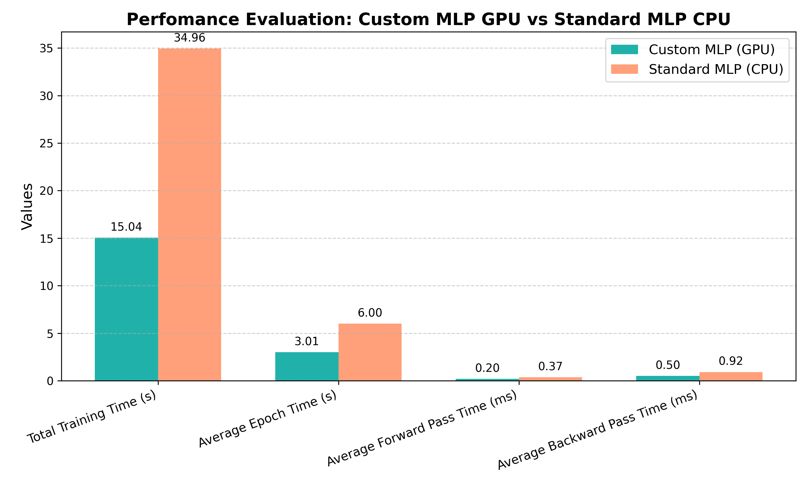
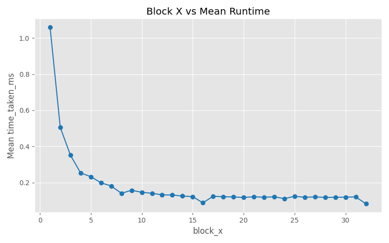
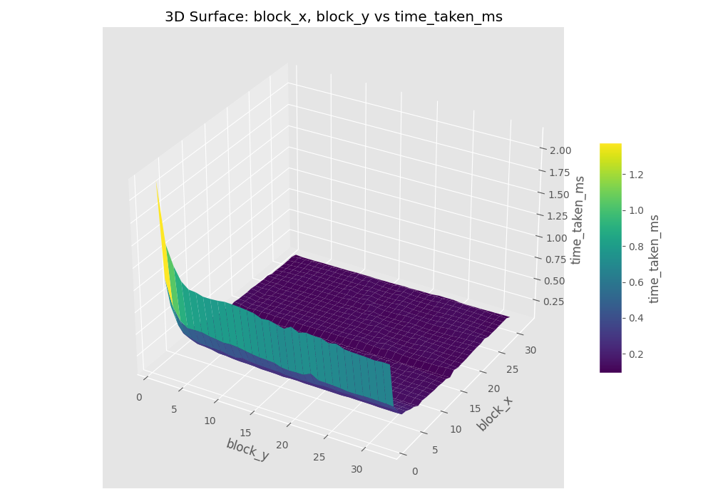

# ML-Guided CUDA Kernel Configuration

## Overview

This project applies a machine learning approach using a PyTorch-based model to predict optimal CUDA kernel launch configurations (such as block and grid sizes) based on input workload characteristics like matrix size. The objective is to automate performance tuning for CUDA applications by dynamically selecting the most efficient configuration using a trained model.

Developed as part of the ECE 759 course at the University of Wisconsin-Madison, this work reflects my contributions to the ML pipeline, benchmarking, diagnostics, and integration of prediction with actual kernel launch.

---

## Features

- **Workload Analysis**: Extracts workload-level features from matrix size and related metadata.
- **ML Model**: Trains a PyTorch model to predict expected runtime for various kernel configurations.
- **Inference Pipeline**: Selects the lowest-runtime configuration from model predictions and launches the kernel accordingly.
- **Benchmark Integration**: Evaluates model accuracy by comparing predictions with actual runtimes across configurations.

---

## Results (verified)

A PyTorch **MLP runtime surrogate** (12 workload/launch features) predicts CUDA kernel execution time, and config selection takes `argmin` over the block/grid search space, replacing exhaustive autotuning with a learned selector.

- **Predictor quality:** **R2 = 0.96**, MAE **0.018 ms** on a held-out 20% test split (R2 about 0.98 on the full set).
- **Selection quality:** the predicted-best block/grid config runs **within ~3% of the exhaustively-measured optimum** (median across workloads); **6 of 7** workloads land within 10% of optimal.
- **Dataset:** 7 GEMM workloads (M from 1 to 256, K=784, N=256), each exhaustively benchmarked over the full **32x32 block grid** (**7,168** measured configurations), in `data/inputs/training_data.csv`.

Honest scope: a small, fixed-shape dataset from a course project, a strong fit on this regime rather than a general autotuning claim.

## Plots







## Reproduce

```bash
pip install -r requirements.txt
python scripts/tuner_model.py       # train the runtime-prediction MLP -> models/
python scripts/run_prediction.py    # predict the best config and launch the kernel
```

---

## Repository Structure

```
Ml-Guided-CUDA-Config/
├── data/                # Input workload files, logs, and matrix size configs
├── models/              # Saved PyTorch model and scalers
├── scripts/             # ML training, prediction, benchmarking, and diagnostics scripts
├── cuda_kernels/        # CUDA kernel (.cu) and host launcher code
├── results/             # Output CSVs, plots, and performance logs
├── docs/                # Final report and documentation
├── LICENSE              # MIT License
├── README.md            # Project overview and usage guide
└── requirements.txt     # Python package dependencies
```

---

## Tools & Technologies
- CUDA
- C++ / Python
- PyTorch (for baseline comparison)
- NVIDIA GPU

---

## Motivation
As MLPs remain foundational in many neural network architectures, optimizing their performance using GPU parallelism can lead to more efficient training pipelines and open doors to deployment in real-time systems.

---

## Future Scope
This project can be extended to other architectures (e.g., CNNs, RNNs), or integrated into broader GPU-accelerated ML frameworks.

---

## License

This project is licensed under the [MIT License](LICENSE).

---

## Author

**Harshith Kantamneni**  
MS in Electrical & Computer Engineering  
University of Wisconsin-Madison
